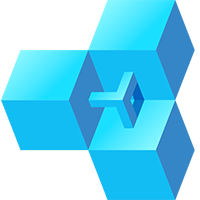

<div id="top"></div>
<!--
*** Thanks for checking out the Best-README-Template. If you have a suggestion
*** that would make this better, please fork the repo and create a pull request
*** or simply open an issue with the tag "enhancement".
*** Don't forget to give the project a star!
*** Thanks again! Now go create something AMAZING! :D
-->

<!-- PROJECT SHIELDS -->
<!--
*** I'm using markdown "reference style" links for readability.
*** Reference links are enclosed in brackets [ ] instead of parentheses ( ).
*** See the bottom of this document for the declaration of the reference variables
*** for contributors-url, forks-url, etc. This is an optional, concise syntax you may use.
*** https://www.markdownguide.org/basic-syntax/#reference-style-links
-->

<!-- PROJECT LOGO -->
<br />
<div align="center">
  <a href="https://github.com/othneildrew/Best-README-Template">
    
  </a>

  <h3 align="center">Defi Stake</h3>

  <p align="center">
    A Dapp that let's you stake WETH, FAU tokens and get DAPP tokes as rewards.
    <br />
  </p>
</div>

<!-- TABLE OF CONTENTS -->
<details>
  <summary>Table of Contents</summary>
  <ol>
    <li>
      <a href="#about-the-project">About The Project</a>
      <ul>
        <li><a href="#built-with">Built With</a></li>
      </ul>
    </li>
    <li>
      <a href="#getting-started">Getting Started</a>
      <ul>
        <li><a href="#prerequisites">Prerequisites</a></li>
        <li><a href="#installation">Installation</a></li>
      </ul>
    </li>
    <li><a href="#license">License</a></li>
    <li><a href="#contact">Contact</a></li>
    <li><a href="#acknowledgments">Acknowledgments</a></li>
  </ol>
</details>

<!-- ABOUT THE PROJECT -->

## About The Project

 

This is a fun weekend project to get myself onboared to build decentralized applications.

<p align="right">(<a href="#top">back to top</a>)</p>

### Built With

This project was build using the following tools

- [VS code](https://code.visualstudio.com/download)
- [Python3](https://www.python.org/)
- [Brownie](https://github.com/eth-brownie/brownie)
- [Typescript](https://www.typescriptlang.org/)
- [React](https://reactjs.org/)
- [Material Design](https://material.io/design)
- [Yarn](https://yarnpkg.com/)
- [useDapp](https://usedapp.io/)

<p align="right">(<a href="#top">back to top</a>)</p>

<!-- GETTING STARTED -->

## Getting Started

This is an example of how you may give instructions on setting up your project locally.
To get a local copy up and running follow these simple example steps.

### Prerequisites

You will need the following to be able to run this project locally

- [Python3](https://www.python.org/)
- [Brownie](https://github.com/eth-brownie/brownie)
- [Infura project key](https://infura.io/) - If you need to deploy to main/ test net
- [Etherscan project key](https://etherscan.io/) - Required if you want to verify the smart contract deployement
- [Metamask wallet](https://metamask.io/)
- [React](https://reactjs.org/)

### Installation

1. Clone the repo
   ```sh
   git clone https://github.com/adityaladwa/defi.git
   ```
2. Create `.env` file in root of project with the following variables

   ```sh
    export PRIVATE_KEY=
    export WEB3_INFURA_PROJECT_ID=
    export ETHERSCAN_TOKEN=
   ```

3. Compile and deploy smart contract
   ```sh
   brownie compile
   brownie run scripts/deploy.py
   ```
4. Run the frontend app
`sh cd front_end yarn start`
<p align="right">(<a href="#top">back to top</a>)</p>

## License

Distributed under the MIT License. See `LICENSE.txt` for more information.

<p align="right">(<a href="#top">back to top</a>)</p>

<!-- CONTACT -->

## Acknowledgments

- [Solidity, Blockchain, and Smart Contract Course – Beginner to Expert Python Tutorial
  ](https://www.youtube.com/watch?v=M576WGiDBdQ)
- [Brownie](https://github.com/eth-brownie/brownie)
- [React](https://reactjs.org/)
- [useDapp](https://usedapp.io/)

<p align="right">(<a href="#top">back to top</a>)</p>

<!-- MARKDOWN LINKS & IMAGES -->
<!-- https://www.markdownguide.org/basic-syntax/#reference-style-links -->

[contributors-shield]: https://img.shields.io/github/contributors/othneildrew/Best-README-Template.svg?style=for-the-badge
[contributors-url]: https://github.com/othneildrew/Best-README-Template/graphs/contributors
[forks-shield]: https://img.shields.io/github/forks/othneildrew/Best-README-Template.svg?style=for-the-badge
[forks-url]: https://github.com/othneildrew/Best-README-Template/network/members
[stars-shield]: https://img.shields.io/github/stars/othneildrew/Best-README-Template.svg?style=for-the-badge
[stars-url]: https://github.com/othneildrew/Best-README-Template/stargazers
[issues-shield]: https://img.shields.io/github/issues/othneildrew/Best-README-Template.svg?style=for-the-badge
[issues-url]: https://github.com/othneildrew/Best-README-Template/issues
[license-shield]: https://img.shields.io/github/license/othneildrew/Best-README-Template.svg?style=for-the-badge
[license-url]: https://github.com/othneildrew/Best-README-Template/blob/master/LICENSE.txt
[linkedin-shield]: https://img.shields.io/badge/-LinkedIn-black.svg?style=for-the-badge&logo=linkedin&colorB=555
[linkedin-url]: https://linkedin.com/in/othneildrew
[product-screenshot]: images/screenshot.png
